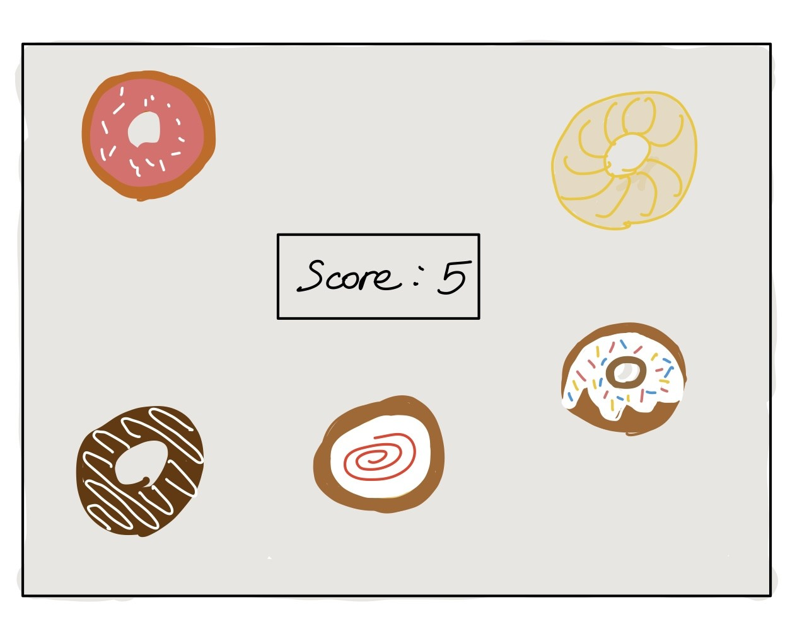

:warning: Everything between << >> needs to be replaced (remove << >> after replacing)

# Food CLick Game
## CS110 B1 Final Project  Fall, 2024

## Team Members

Jeannie Lee

***

## Project Description
This game challenges players to click on bread, donuts, knives, forks, and gifts to adjust their score. Bread and donuts must be clicked to gain points and prevent automatic deductions over time. The true excitement lies when bread and donuts are no longer available, leaving only knives, forks, and the gift. Will you take the safe route of losing just 1 or 2 points, or risk it all by clicking the gift, which could either add or subtract 5 points? It’s a game that highlights the thrill of making strategic choices.

***    

## GUI Design

### Initial Design

### Final Design

## Program Design

### Features

- Players start with 10 points.
- Every 4 seconds, 1 point is automatically deducted.
- Players can interact by clicking on moving items to gain or lose points:
  - Donut: +1 point
  - Bread: +2 points
  - Fork: -1 point
  - Knife: -2 points
- A special gift item appears randomly:
  - Clicking it adds or subtracts 5 points randomly.
- The game ends if:
  - The score reaches 0.
  - The timer reaches 30 seconds.
- Items move faster as time progresses, increasing difficulty.

### Classes

1. `GameController`
- **Description:** Manages the overall game state and logic, including score tracking, item updates, and player       interactions.
- **Key Methods:**
  - `add_items(images)`: Adds game items (donut, bread, fork, knife) to the screen.
  - `update()`: Updates the position and speed of all items and the special gift.
  - `render(images, gift_image)`: Draws all items and the gift on the screen.
  - `handle_click(pos)`: Handles player clicks and adjusts the score based on the clicked item.

---

2. `Item`
- **Description:** Represents the general items in the game (donut, bread, fork, knife). Each item has a specific effect on the score.
- **Key Methods:**
  - `move()`: Moves the item upward and resets its position if it goes off-screen.
  - `draw(screen, images)`: Renders the item on the screen using the appropriate image.

---

3. `Gift`
- **Description:** Represents the special gift item. It appears randomly and has a unique effect, either adding or subtracting 5 points.
- **Key Methods:**
  - `move()`: Moves the gift upward and resets its position if it goes off-screen.
  - `draw(screen, image)`: Renders the gift on the screen.

---

## ATP

| Step | Procedure                  | Expected Results                                |
|------|----------------------------|-----------------------------------------------|
|  1   | Run the game               | The GUI window appears with `Score = 10`.     |
|  2   | Click on a donut           | The score increases by 1 point.               |
|  3   | Click on a bread           | The score increases by 2 points.              |
|  4   | Click on a fork            | The score decreases by 1 point.               |
|  5   | Click on a knife           | The score decreases by 2 points.              |
|  6   | Click on a gift            | The score changes by +5 or -5 randomly.       |
|  7   | Do nothing for 4 seconds   | The score decreases by 1 automatically.       |
|  8   | Wait until 30 seconds      | The "Game Over" message appears.              |
|  9   | Let the score reach 0      | The "Game Over" message appears.              |

