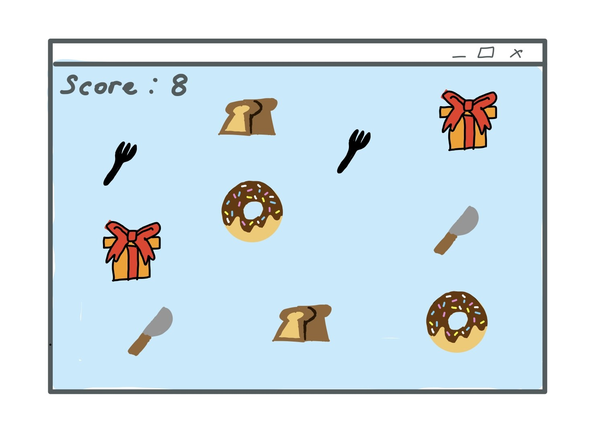

:warning: Everything between << >> needs to be replaced (remove << >> after replacing)

# Traffic Controller
## CS110 B1 Final Project  Fall, 2024

## Team Members

Jeannie Lee

***

## Project Description

This is a traffic light management game. The player controls traffic lights at a busy intersection. The goal is to prevent collisions and ensure a smooth flow of traffic while keeping pedestrians safe. The game becomes more challenging as vehicle and pedestrian traffic increases over time.

***    

## GUI Design

### Initial Design

### Final Design

## Program Design

### Features

1. Traffic Light Control: The player changes traffic light colors to manage vehicle and pedestrian flow.
2. Collision Detection: The game detects vehicle collisions or pedestrian accidents.
3. Level Progression: Traffic increases in speed and volume as levels progress.
4. Timer System: Players have limited time to complete each level.
5. Score Tracking: Points are awarded for safely managing traffic and deducted for collisions.

### Classes

- << You should have a list of each of your classes with a description >>

## ATP

| Step                 |Procedure             |Expected Results                   |
|----------------------|:--------------------:|----------------------------------:|
|  1                   | Run Counter Program  |GUI window appears with count = 0  |
|  2                   | click count button   | display changes to count = 1      |
etc...
